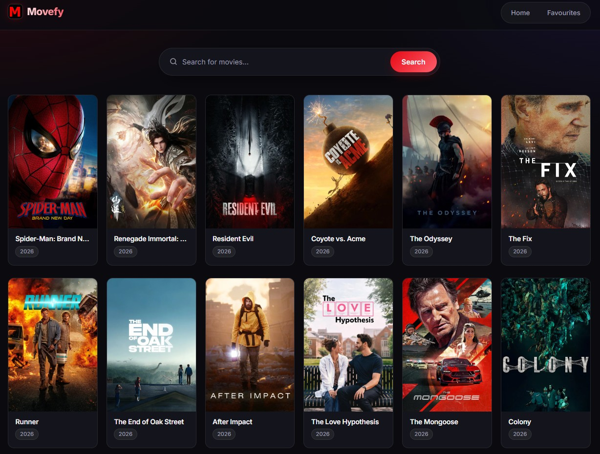

<div align="center">


### [🎬 Live demo → movefy.thenujahansana.dev](https://movefy.thenujahansana.dev)


<br />

<a href="https://movefy.thenujahansana.dev">
  
</a>

</div>

## Features

- **Browse** what's popular right now, powered by TMDB
- **Search** any movie by title
- **Favourite** movies with one click — they're saved in your browser
- **Responsive** dark UI that works on desktop and mobile

## Run locally

```bash
git clone https://github.com/Thenuja-Hansana/react-movie-app.git
cd react-movie-app/frontend
npm install
cp .env.example .env   # then add your TMDB API key
npm run dev
```

Get a free API key from [TMDB](https://www.themoviedb.org/settings/api).

---

<sub>This product uses the TMDB API but is not endorsed or certified by TMDB.</sub>
